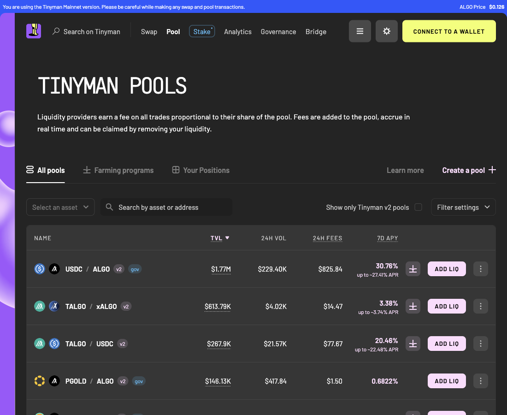
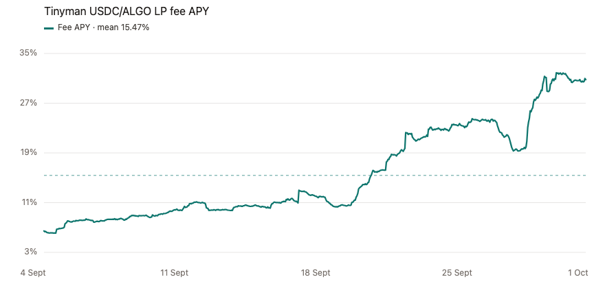
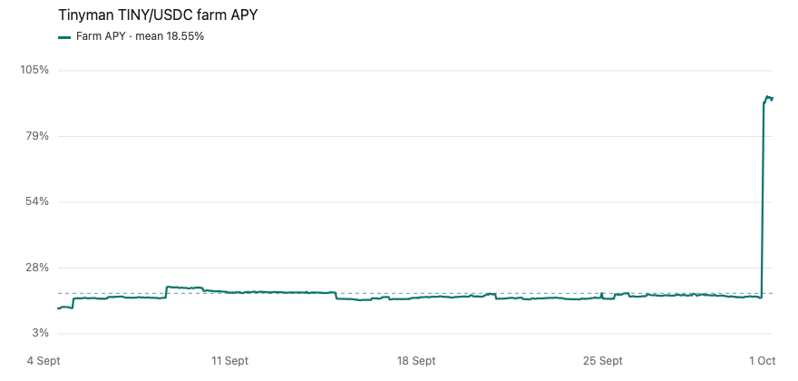
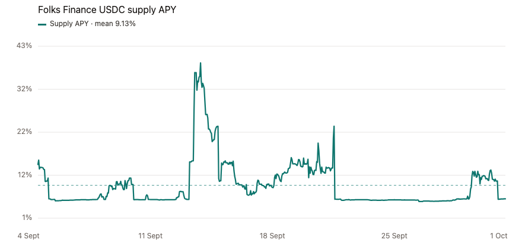
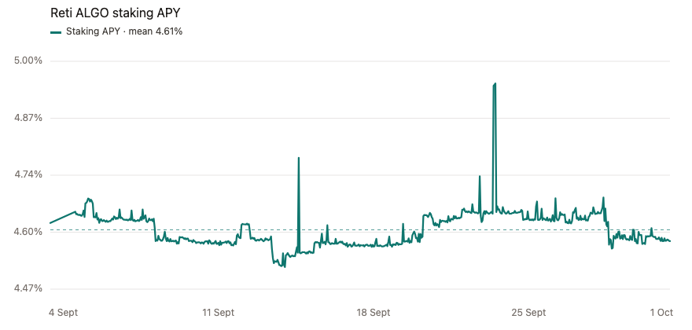

# What a headline APY leaves out

A venue page shows one APY. That number is a print from the moment you loaded the page. Canix keeps an hourly sample of the same figure, for up to 30 days, and scores how far those hours wander from their own average.

The five cases below are from a production-path catalog read at 09:35 UTC on 1 October 2026, and from the hourly series behind it. The window runs from 4 September through the 09:00 sample on 1 October: 634 to 645 hours, depending on the row. The dashed line on each chart is the average of that series. Each chart uses its own vertical scale, so a quiet series is readable and a spike still has room.

Stability is the coefficient of variation of those hours: the standard deviation of APY divided by the absolute average APY.

| Coefficient of variation | Stability |
|---|---|
| 0.05 or below | high |
| 0.20 or below | medium |
| above 0.20 | low |

A `low` bucket means the average over the sample was below `stdev / 0.20`. In these rows the actual average is available, so the stories use that average.

## The flagship badge is the top of a climb

Tinyman’s verified pool list leads with USDC/ALGO. Later the same morning the list showed **30.76%** 7-day APY and **$1.77 million** of liquidity. The catalog read an hour earlier was **30.51%** on **$1,774,470**. The badge and the pool are the same. The month underneath them is not a 30% rate.

On 4 September the fee APY was about **6.4%**. It rose through the month, with a dip toward 19% late in September, and the last morning sample was **30.53%**. Across 634 hours the average is **15.47%** and the standard deviation is **7.28** points, so the stability bucket is `low`.

Someone sorting venues by today’s 30% is ranking the high end of a climb. The month a liquidity provider actually lived through averaged about half of that.

| | |
|---|---|
| APY at the catalog read | 30.51% |
| Sample mean | 15.47% |
| Sample standard deviation | 7.28 points |
| Samples | 634 |
| Stability | low |

## One pool page, two yields

TALGO/USDC is the third row on that same list: **20.48%** and about **$268,000**. The catalog LP row is **20.23%** on **$268,481**. Canix also keeps the farm on that pool as its own opportunity. The page’s large number is the fee yield. The farm is a separate series, and it did not make the same climb.

The fee LP opened the window at **4.91%** and finished at **20.27%**. Its average is **9.59%**, standard deviation **5.38** points, stability `low`. The farm on the same liquidity spent the month near **2%**, then lifted to **3.97%** in the final hours. Its average is **2.24%**, standard deviation **0.33** points, stability `medium`.

A 20% badge on this pool is the fee series at the end of its own climb. The reward program sitting on the same deposits has been the quieter of the two.

| | Fee LP | Farm |
|---|---|---|
| APY at the catalog read | 20.23% | 3.96% |
| Sample mean | 9.59% | 2.24% |
| Sample standard deviation | 5.38 points | 0.33 points |
| Samples | 634 | 634 |
| Stability | low | medium |

## Ninety-four percent, for a day

The TINY/USDC farm prints **94.24%** on about **$10,600** of liquidity. A sort by headline APY puts a thin farm like this at the top of the page.

From 4 September through 30 September the farm stayed between **12.7%** and **21.1%**. The first samples on 1 October are already **92%**, and the catalog print is **94.24%**. The average of all 634 hours is **18.55%**. The standard deviation is **9.13** points, and the bucket is `low`, because one morning at 94% is riding on a month that lived in the teens.

The LP row for the same pair is a smaller version of a moving fee yield: **12.18%** at the catalog read, average **7.57%**, standard deviation **2.28**, also `low`.

| | Farm | LP, same pair |
|---|---|---|
| APY at the catalog read | 94.24% | 12.18% |
| Sample mean | 18.55% | 7.57% |
| Sample standard deviation | 9.13 points | 2.28 points |
| Samples | 634 | 634 |
| Stability | low | low |
| TVL | $10,558 | |

## The calm lend is the low print

Folks Finance USDC lending looks like an ordinary large market: **5.83%** supply APY and **$4,545,163** deposited. A 5.8% lend on a multi-million-dollar book reads as settled.

The 5.83% on the morning of 1 October is close to the lowest hour in the window, **5.18%**. On 13 September the same supply rate reached **38.87%**, and it was still above 30% for part of the next day. Another spike reached **23.49%** on 21 September. The average of 645 hours is **9.13%**, and the standard deviation is **5.71** points, so the bucket is `low`.

The number on screen is a real rate. It is the quiet end of a month that included a day near 39%.

| | |
|---|---|
| APY at the catalog read | 5.83% |
| Sample mean | 9.13% |
| Sample standard deviation | 5.71 points |
| Samples | 645 |
| Stability | low |
| TVL | $4,545,163 |

## The dull headline that held

Reti ALGO staking, validator 159, is easy to pass over beside 20% and 30% pool badges: **4.58%** on **$1,050,650** staked.

The chart is zoomed on purpose. The whole window, 641 hours, sits between **4.52%** and **4.95%**. The spikes visible on that scale are still tenths of a point. The average is **4.61%** and the standard deviation is **0.042** points, so the bucket is `high`. The 4.58% on screen is the month.

| | |
|---|---|
| APY at the catalog read | 4.58% |
| Sample mean | 4.61% |
| Sample standard deviation | 0.042 points |
| Samples | 641 |
| Stability | high |
| TVL | $1,050,650 |

## How this changes the order

Canix ranks by a risk penalty first. This stability bucket is part of that penalty: `high` adds nothing, `medium` adds one, `low` adds two. Rows with the same penalty then sort by APY, then by TVL. A 30% pool with `low` stability can sit below a smaller yield whose month actually held.
