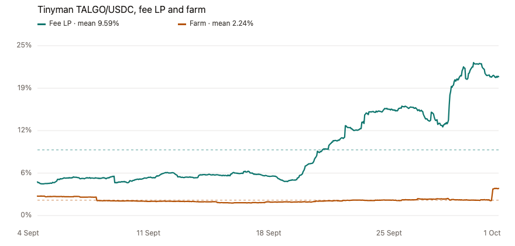

# What a headline APY leaves out

Every yield page shows you one APY. What it doesn't tell you is that the number is a snapshot, taken the moment you loaded the page. Was it 30% all month, or did it only get there this morning? From the page alone, you can't tell.

Canix402 can, because it records the same figure every hour for up to 30 days. Then it asks a simple question: how far does this yield wander from its own average?

The five examples below come from a live Canix402 catalog read at 09:35 UTC on 1 October 2026, plus the hourly history behind each row. That history runs from 4 September to the 09:00 sample on 1 October, which is 634 to 645 hours depending on the row. On each chart, the dashed line is the average for the period. Each chart has its own vertical scale, so a quiet series is still readable and a spike still has room.

## How we score stability

We use the coefficient of variation: the standard deviation of the hourly APY divided by its average. In plain terms, it's how big the swings are compared with the typical rate.

| Coefficient of variation | Stability |
|---|---|
| 0.05 or below | high |
| 0.20 or below | medium |
| above 0.20 | low |

So `low` means the swings are more than a fifth the size of the average. For every row below we have the real average, so that's what we use.

## The headline is the top of a climb

Open Tinyman's verified pool list and USDC/ALGO sits right at the top: **30.76%** 7-day APY on **$1.77 million** of liquidity. Our catalog read an hour earlier had **30.51%** on **$1,774,470**. Same pool, same number. But was it 30% all month? 

On 4 September the fee APY was about **6.4%**. It climbed through the month, dipped toward 19% late in September, and the last morning sample was **30.53%**. Over 634 hours the average was **15.47%**, with a standard deviation of **7.28** points. That makes it `low` stability.

Sort by today's 30% and you're ranking the peak of a climb. Anyone who actually provided liquidity over the month earned about half that.

| | |
|---|---|
| APY at the catalog read | 30.51% |
| Sample mean | 15.47% |
| Sample standard deviation | 7.28 points |
| Samples | 634 |
| Stability | low |

## One pool, two very different yields

Third on the same list is TALGO/USDC: **20.48%** on about **$268,000**. Our catalog has the liquidity position at **20.23%** on **$268,481**. Here's the catch: the pool also has a farm, and Canix402 tracks it as a separate opportunity. The big number on the page is the trading-fee yield. The farm told a different story.

The fee yield started the period at **4.91%** and finished at **20.27%**, averaging **9.59%** with a standard deviation of **5.38** points, which is `low` stability. The farm on the same deposits sat near **2%** for most of the month and only lifted to **3.97%** in the final hours. It averaged **2.24%** with a standard deviation of **0.33** points, which is `medium`.

So that 20% is, again, the fee yield at the top of its climb. The rewards on the same deposits were the quieter of the two by a long way.

| | Fee LP | Farm |
|---|---|---|
| APY at the catalog read | 20.23% | 3.96% |
| Sample mean | 9.59% | 2.24% |
| Sample standard deviation | 5.38 points | 0.33 points |
| Samples | 634 | 634 |
| Stability | low | medium |

## 94%, for one morning

The TINY/USDC farm shows **94.24%** on about **$10,600** of liquidity. Sort a page by headline APY and a small farm like this jumps straight to the top.

From 4 to 30 September, the farm stayed between **12.7%** and **21.1%**. Then, on the morning of 1 October, it was suddenly at **92%**, and **94.24%** by the time of our read. Averaged over all 634 hours it's **18.55%**, with a standard deviation of **9.13** points. That's `low` stability: one morning at 94% sitting on top of a month in the teens.

The liquidity position for the same pair shows the same pattern on a smaller scale: **12.18%** at the read, a **7.57%** average, a **2.28** point standard deviation, and also `low`.

| | Farm | LP, same pair |
|---|---|---|
| APY at the catalog read | 94.24% | 12.18% |
| Sample mean | 18.55% | 7.57% |
| Sample standard deviation | 9.13 points | 2.28 points |
| Samples | 634 | 634 |
| Stability | low | low |
| TVL | $10,558 | |

## The calm lending rate that wasn't

Folks Finance USDC lending looks like the safe, boring option: **5.83%** supply APY on **$4,545,163** deposited. A big book paying under 6% feels settled. It wasn't.

That 5.83% on the morning of 1 October is close to the lowest hour of the whole period, which was **5.18%**. On 13 September the same rate hit **38.87%**, and it stayed above 30% for part of the next day. On 21 September it jumped again, to **23.49%**. Over 645 hours it averaged **9.13%**, with a standard deviation of **5.71** points, so it's `low`.

The number on screen is real. It's just the quiet end of a month that included a day close to 39%.

| | |
|---|---|
| APY at the catalog read | 5.83% |
| Sample mean | 9.13% |
| Sample standard deviation | 5.71 points |
| Samples | 645 |
| Stability | low |
| TVL | $4,545,163 |

## The boring one that held

Next to 20% and 30% pool badges, Reti ALGO staking on validator 159 is easy to skip: **4.58%** on **$1,050,650** staked. But it's the only one here where the number on the page is the month.

We zoomed this chart in on purpose. Across all 641 hours, the rate stayed between **4.52%** and **4.95%**. The "spikes" you can see at this scale are tenths of a point. It averaged **4.61%**, with a standard deviation of just **0.042** points, which earns it `high` stability. What you see is what you got.

| | |
|---|---|
| APY at the catalog read | 4.58% |
| Sample mean | 4.61% |
| Sample standard deviation | 0.042 points |
| Samples | 641 |
| Stability | high |
| TVL | $1,050,650 |

## How Canix402 uses this when ranking

Canix402 ranks opportunities by a risk penalty first, and stability is part of that penalty. `high` adds nothing, `medium` adds one point and `low` adds two. Opportunities with the same penalty are then sorted by APY, then by TVL.

The result is that a 30% pool that only just got there can rank below a smaller yield that actually held all month. That's on purpose: the yield that held is the better guide to what you'll actually earn.

## Check the month, not the moment

Every number in this piece came from Canix402, and your agent can pull the same data. Canix402 tracks yields across the major Algorand DeFi apps, including Tinyman, Folks Finance, Pact, CompX, Dork.fi and Reti, plus Morpho, Aave and Aerodrome on Base. Opportunities are ranked by risk first and APY second, so a one-morning spike doesn't jump the queue.

Want the full story behind a headline rate? The 30-day history for any opportunity, stability score included, costs $0.01 USDC over x402. You don't need an account or an API key. Your agent just pays for the call and gets the answer.

Canix402 can also build the deposit for you. It returns unsigned transactions that your wallet signs and submits itself, so Canix402 never moves your funds.

Your agent can connect through MCP at https://canix402-mcp.compx.io/mcp
Humans can use Canix402 on the web at https://canix402.compx.io/webmcp

Before you chase the next 94%, ask Canix402 what the real story is.
